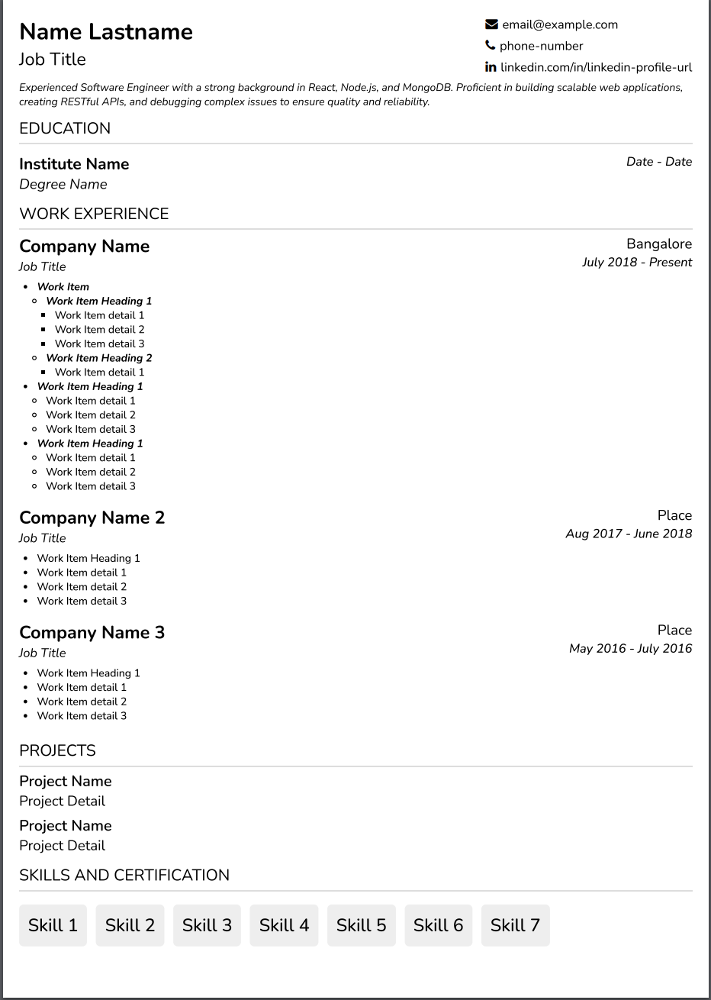

# Resume Generator

A modern, responsive web application for creating and customizing professional resumes from JSON templates.



## Features

- **Template-Based Resume Generation**: Create professional resumes from JSON data
- **Export/Import Functionality**: Download resume templates and upload your own data
- **Font Size Controls**: Adjust text size to fit content perfectly on a single page
- **Print Optimization**: Properly formatted for A4 paper printing
- **Responsive Design**: Works on all device sizes
- **Customizable Sections**: Education, Work Experience, Projects, Skills, and Achievements

## Installation

1. Clone the repository:
```bash
git clone https://github.com/yourusername/resume-generator.git
cd resume-generator
```

2. Install dependencies:
```bash
npm install
```

3. Start the development server:
```bash
npm start
```

The application will be available at [http://localhost:3000](http://localhost:3000).

## Usage

### Creating a Resume

1. **Download Template**: Click the "Download Template" button to get a JSON template file
2. **Edit Template**: Open the downloaded JSON file in any text editor and fill in your information
3. **Upload Data**: Click "Upload Resume Data" to upload your edited JSON file
4. **Adjust Font Size**: Use the font size controls to fit content on a single page
5. **Print**: Click the "Print Resume" button to open the print dialog

### Template Format

The JSON template follows this structure:

```json
{
  "headerInfo": {
    "name": "Your Name",
    "currentPosition": "Your Job Title",
    "summary": "Your professional summary"
  },
  "contactInfo": {
    "email": {
      "value": "mailto:your-email@example.com",
      "displayValue": "your-email@example.com"
    },
    "phone": {
      "value": "tel:your-phone-number",
      "displayValue": "your-phone-number"
    },
    "linkedin": {
      "value": "https://www.linkedin.com/in/your-profile",
      "displayValue": "linkedin.com/in/your-profile"
    }
  },
  "workExperience": {
    "Company Name": {
      "fromDate": "Start Date",
      "toDate": "End Date",
      "place": "Location",
      "jobTitle": "Job Title",
      "workItems": [
        "Description of responsibilities and achievements"
      ]
    }
  },
  "education": {
    "Degree Name": {
      "name": "Institution Name",
      "from": "Start Date",
      "to": "End Date",
      "summary": []
    }
  },
  "projects": [
    {
      "title": "Project Name",
      "detail": "Project Description"
    }
  ],
  "skills": [
    "Skill 1",
    "Skill 2",
    "Skill 3"
  ],
  "achievements": []
}
```

## Customization

### Styling

The resume layout and styling can be customized by editing the CSS files:

- `Resume.css`: Main resume container styles
- `Components/Header/Header.css`: Header section styles
- `Components/WorkExperience/WorkExperience.css`: Work experience section styles
- And other component-specific CSS files

### Adding New Sections

To add new sections to the resume, create a new component in the Components directory and import it in the `Resume.js` file.

## Technologies Used

- React.js
- CSS3
- Font Awesome
- JSON

## Contributing

Contributions are welcome! Please feel free to submit a Pull Request.

1. Fork the repository
2. Create your feature branch (`git checkout -b feature/amazing-feature`)
3. Commit your changes (`git commit -m 'Add some amazing feature'`)
4. Push to the branch (`git push origin feature/amazing-feature`)
5. Open a Pull Request

## License

This project is licensed under the MIT License - see the LICENSE file for details.

## Acknowledgments

- Font Awesome for the icons
- React.js team for the amazing framework 